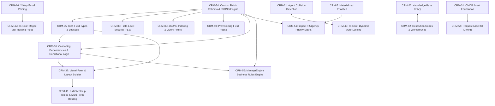

# 876 CRM — Holistic Issues & Product Scaling Roadmap

- **Status:** ACTIVE ROADMAP 🗺️
- **Date:** 2026-09-03
- **Companion Guides:** [`docs/876-crm.md`](file:///root/projects/876/docs/876-crm.md), [`docs/architecture/023-876-crm.md`](file:///root/projects/876/docs/architecture/023-876-crm.md), [`packages/crm/README.md`](file:///root/projects/876/packages/crm/README.md)
- **Tracking Project:** `CRM` (`876 CRM`) in 876 Projects

---

## 1. The Strategic Vision: Scaling 876 CRM

876 CRM is designed to scale across four deliberate product archetypes:

```
┌─────────────────────────────────────────────────────────────────────────────┐
│  Phase 1: Zoho Bigin Parity (Immediate Target)                              │
│  Pipeline-centric simplicity for small teams: visual Kanban, deals,         │
│  scheduling booking pages, Twilio click-to-call, and AI MCP server.         │
└──────────────────────────────────────┬──────────────────────────────────────┘
                                       │
                                       ▼
┌─────────────────────────────────────────────────────────────────────────────┐
│  Phase 2: Ticketing & Customer Support (osTicket + Zendesk Parity)          │
│  Operational ticketing depth: strict SLAs, breach escalation, canned       │
│  macros, ticket merge/split, self-service Knowledge Base, and CSAT surveys. │
└──────────────────────────────────────┬──────────────────────────────────────┘
                                       │
                                       ▼
┌─────────────────────────────────────────────────────────────────────────────┐
│  Phase 3: Advanced Sales & Account CRM (Zoho CRM Parity)                    │
│  Enterprise sales management: cold Lead staging, conversion pipelines,      │
│  pipeline blueprints, email drip sequences, and sales forecasting.         │
└──────────────────────────────────────┬──────────────────────────────────────┘
                                       │
                                       ▼
┌─────────────────────────────────────────────────────────────────────────────┐
│  Phase 4: Enterprise ITIL & Service Desk (ManageEngine ServiceDesk Plus)    │
│  Full ITSM service plane: Incident vs Problem management, CAB change        │
│  approvals, CMDB configuration items, and enterprise IT service catalogs.   │
└─────────────────────────────────────────────────────────────────────────────┘
```

---

## 2. Capability Evolution Matrix

| Capability Dimension | Completed Foundation (Today)                   | Phase 1: Zoho Bigin Parity (Target First) | Phase 2: osTicket / Zendesk Ticketing       | Phase 3: Zoho CRM Scale                        | Phase 4: ManageEngine ServiceDesk (ITSM)     |
| :------------------- | :--------------------------------------------- | :---------------------------------------- | :------------------------------------------ | :--------------------------------------------- | :------------------------------------------- |
| **Record Model**     | `Request` with 6 statuses & channels           | Requests + Deal values & close dates      | Tickets with SLA tracking & ticket merging  | Multi-entity: Leads, Contacts, Accounts, Deals | ITIL: Incidents, Problems, Changes, Releases |
| **Pipeline Visuals** | Filterable list table                          | Drag-and-drop Kanban Board                | Filtered queues & triage inboxes            | Multi-pipeline stage gates & blueprints        | ITIL workflow states & approval steps        |
| **Intake Channels**  | Form, widget, chat, email, API, agent          | Inbound 2-way email sync                  | Email piping, customer help portal          | Omnichannel lead capture                       | IT Service Catalog & hardware requests       |
| **Communication**    | Internal notes, private teammate notes, emails | Twilio in-app phone dialer                | Canned responses & action macros            | Drip email cadences & sequences                | Change Advisory Board (CAB) reviews          |
| **Self-Service**     | Hosted / embedded form intake                  | Shareable calendar booking links          | Public Knowledge Base (FAQ) & ticket portal | Client portal with quote acceptance            | IT Service Catalog with pricing & tiers      |
| **Financial Tie-In** | Live Billing ledger & statements               | Payment links & quotes                    | Billing dispute ticket linkage              | Multi-currency price books & quotas            | Asset depreciation & maintenance contracts   |
| **Productivity**     | 876 Work tasks & scheduled reminders           | Work-backed rep booking availability      | Ticket resolution timers & agent collision  | Task automations & sales cadences              | Asset check-in/check-out & audit tasks       |
| **Quality & SLA**    | Request priority palette (weight/sort)         | SLA warning indicators                    | Formal SLA breach policies & CSAT           | Sales rep KPI tracking & leaderboards          | Priority matrix (Urgency × Impact)           |

---

## 3. Master Issues Catalog

Every issue below is tracked under project **`CRM`** (`prj_42dcb6fc15584480842af83ef449d55a`) in 876 Projects:

### Phase 0: Completed Core Foundation (`m:crm-done`)

- **[CRM-1](file:///root/projects/876/apps/crm-api): [Done] Bounded CRM Data Service & Multi-Tenant Engine**
  - **Status:** `done` | **Priority:** `high` | **Labels:** `m:crm-done`, `area:api`, `area:schema`
  - **Scope:** Express 5 and Prisma 7 data service (`apps/crm-api`, port 4010) with multi-tenant isolation by tenantId and atomic sequential request numbering (`#1`, `#2`...). 57 test files, 747 unit/integration tests.
- **[CRM-2](file:///root/projects/876/apps/crm-api/prisma/schema/customer.prisma): [Done] Unified Customer Profiles linked to Billing Data Plane**
  - **Status:** `done` | **Priority:** `urgent` | **Labels:** `m:crm-done`, `area:api`, `area:schema`
  - **Scope:** `CustomerProfile` model referencing `billingCustomerId` with zero financial data duplication. Connects server-to-server via `@876/billing/integration` to render live statements, ledgers, and invoice records.
- **[CRM-3](file:///root/projects/876/apps/crm-api/prisma/schema/request.prisma): [Done] Core Request Management & Multi-Channel Intake**
  - **Status:** `done` | **Priority:** `high` | **Labels:** `m:crm-done`, `area:api`, `area:ui`
  - **Scope:** Unified `Request` model with 6 lifecycle statuses (`OPEN`, `IN_PROGRESS`, `WAITING`, `RESOLVED`, `CLOSED`, `CANCELLED`), priority, category/subcategory taxonomy, team routing, assignee, and multi-channel intake (`FORM`, `WIDGET`, `CHAT`, `EMAIL`, `API`, `AGENT`).
- **[CRM-4](file:///root/projects/876/apps/crm-api/prisma/schema/request.prisma#L87): [Done] Request Conversation Thread & Threaded Notes**
  - **Status:** `done` | **Priority:** `high` | **Labels:** `m:crm-done`, `area:api`, `area:ui`
  - **Scope:** Rich conversation engine supporting public messages, internal team notes, teammate private notes (`privateToUserId`), and full RFC email envelope headers (`direction`, `from`, `to`, `cc`, `subject`, `messageId`).
- **[CRM-5](file:///root/projects/876/apps/crm-api/prisma/schema/team.prisma): [Done] Team Workspaces & Automated Work Routing**
  - **Status:** `done` | **Priority:** `medium` | **Labels:** `m:crm-done`, `area:api`, `area:ui`
  - **Scope:** `Team` and `TeamMember` models with `LEAD` and `MEMBER` roles. Automated ticket assignment algorithms: `NONE`, `ROUND_ROBIN`, and `LEAST_BUSY` for workload balancing.
- **[CRM-6](file:///root/projects/876/apps/crm-api/prisma/schema/form.prisma): [Done] Dynamic Request Form Studio & Intake Submissions**
  - **Status:** `done` | **Priority:** `high` | **Labels:** `m:crm-done`, `area:api`, `area:ui`
  - **Scope:** Versioned dynamic form builder with JSON schema definitions, `HOSTED` and `EMBEDDED` placements, answer submission snapshots, and automated request generation with default team/priority.
- **[CRM-7](file:///root/projects/876/apps/crm-api/prisma/schema/priority.prisma): [Done] Materialized Tenant Priorities & Category Taxonomies**
  - **Status:** `done` | **Priority:** `medium` | **Labels:** `m:crm-done`, `area:api`, `area:schema`
  - **Scope:** Dynamic tenant configuration materialized from published `application/876-crm` provisioning manifests. Organizations customize priority colors, icons, weights, and category hierarchies without breaking platform reconciliation.
- **[CRM-8](file:///root/projects/876/docs/architecture/019-work-service-and-productivity-plane.md): [Done] Shared Productivity Plane Integration (876 Work Tasks & Reminders)**
  - **Status:** `done` | **Priority:** `high` | **Labels:** `m:crm-done`, `area:integrations`
  - **Scope:** Request checklist tasks and scheduled reminders delegated to 876 Work (`apps/work-api`) with context `{ service: "crm", resource: "request", id }`, providing unified to-dos across the 876 ecosystem in "My Work".
- **[CRM-9](file:///root/projects/876/apps/crm-api/src/modules/events/events.service.ts): [Done] Calendar Event Scheduling & Participant Invites**
  - **Status:** `done` | **Priority:** `medium` | **Labels:** `m:crm-done`, `area:integrations`
  - **Scope:** Request meeting scheduling backed by 876 Work `WorkEventResource`. Supports locations, timezones, busy status, and multi-participant invitees with RSVP tracking.
- **[CRM-10](file:///root/projects/876/packages/crm-ui/src/request-record-shell.tsx): [Done] Shared CRM UI Components & Console Operator Desk**
  - **Status:** `done` | **Priority:** `high` | **Labels:** `m:crm-done`, `area:ui`
  - **Scope:** `@876/crm-ui` shared split-view layout (`RequestRecordShell`), `CustomerOverview`, and Console operator desk parity at `/workspace/[orgSlug]/crm` with support for Conversation, Customer, Tasks, Reminders, Schedule, and Audit tabs.

---

### Phase 1: Zoho Bigin Parity — Immediate Target (`m:crm-1-bigin`, `parity:bigin`)

- **CRM-11: [Bigin] Visual Kanban Pipeline Board for Requests**
  - **Status:** `in-progress` | **Priority:** `urgent` | **Estimate:** 5 | **Labels:** `m:crm-1-bigin`, `parity:bigin`, `area:ui`
  - **Description:** Add a visual drag-and-drop Kanban pipeline board for CRM requests grouped by status (`OPEN`, `IN_PROGRESS`, `WAITING`, `RESOLVED`, `CLOSED`). Reuses `@876/projects-ui` board components, card frames, and column metrics for quick deal/ticket progression.
- **CRM-12: [Bigin] Deal Values, Expected Close Dates & Win/Loss Tracking**
  - **Status:** `todo` | **Priority:** `high` | **Estimate:** 3 | **Labels:** `m:crm-1-bigin`, `parity:bigin`, `area:schema`, `area:api`
  - **Description:** Enhance sales requests with financial deal attributes: estimated deal value (currency & minor units), expected close date, win probability %, and win/loss reason categorization upon closure.
- **CRM-13: [Bigin] External Public Booking Pages for Customer Meetings**
  - **Status:** `todo` | **Priority:** `medium` | **Estimate:** 5 | **Labels:** `m:crm-1-bigin`, `parity:bigin`, `area:integrations`, `area:ui`
  - **Description:** Provide shareable, customer-facing meeting booking links (like Calendly / Bigin Booking Pages). Checks rep availability via 876 Work calendars and automatically books confirmed appointments onto the request schedule.
- **CRM-14: [Bigin] In-App Telephony Dialing & Twilio Call Logging UI**
  - **Status:** `todo` | **Priority:** `high` | **Estimate:** 5 | **Labels:** `m:crm-1-bigin`, `parity:bigin`, `area:integrations`, `area:ui`
  - **Description:** Embed a click-to-call softphone dialer inside the CRM request aside, wiring up the existing 876 Twilio communications platform (`twilio-communications.md`). Logs call duration, timestamps, and call recordings.
- **CRM-15: [Bigin] 876 CRM MCP Server (`apps/crm-mcp`)**
  - **Status:** `todo` | **Priority:** `high` | **Estimate:** 3 | **Labels:** `m:crm-1-bigin`, `parity:bigin`, `area:api`
  - **Description:** Create an MCP (Model Context Protocol) server for 876 CRM mirroring `apps/projects-mcp`. Exposes tools to AI assistants: `crm_list_requests`, `crm_create_request`, `crm_search_customers`, `crm_add_note`, and `crm_update_status`.
- **CRM-16: [Bigin] Two-Way Email Sync & Client Inbound Email Parsing**
  - **Status:** `todo` | **Priority:** `high` | **Estimate:** 8 | **Labels:** `m:crm-1-bigin`, `parity:bigin`, `area:api`, `area:integrations`
  - **Description:** Implement automated email ingestion for incoming customer replies via Webhook / IMAP piping. Matches email headers to existing request threads, parses body text, extracts attachments, and logs `RequestNote` records.

---

### Phase 2: Ticketing & Helpdesk Depth — osTicket & Zendesk (`m:crm-2-ticketing`, `parity:osticket`, `parity:zendesk`)

- **CRM-17: [osTicket] Service Level Agreement (SLA) Engine & Breach Escalation**
  - **Status:** `backlog` | **Priority:** `urgent` | **Estimate:** 8 | **Labels:** `m:crm-2-ticketing`, `parity:osticket`, `area:api`, `area:schema`
  - **Description:** Configurable SLA policies with first-response and target-resolution time targets. Supports operating hours calendars, warning thresholds, overdue visual badges, and automated manager notification on breach.
- **CRM-18: [osTicket] Canned Responses & Action Macros**
  - **Status:** `backlog` | **Priority:** `medium` | **Estimate:** 3 | **Labels:** `m:crm-2-ticketing`, `parity:osticket`, `area:ui`, `area:api`
  - **Description:** Library of pre-defined response templates with template variable interpolation (`{{customer.name}}`, `{{request.number}}`). Supports action macros that reply, change status, and reassign team in a single click.
- **CRM-19: [osTicket] Ticket Merge, Split, and Parent-Child Linkage**
  - **Status:** `backlog` | **Priority:** `medium` | **Estimate:** 5 | **Labels:** `m:crm-2-ticketing`, `parity:osticket`, `area:api`
  - **Description:** Support merging duplicate tickets into a canonical master request, splitting unrelated conversation messages out into a fresh request, and establishing parent-child tracking links.
- **CRM-20: [osTicket] Customer Self-Service Portal & Knowledge Base (FAQ)**
  - **Status:** `backlog` | **Priority:** `high` | **Estimate:** 8 | **Labels:** `m:crm-2-ticketing`, `parity:osticket`, `area:ui`, `area:api`
  - **Description:** Public self-service helpdesk portal with searchable markdown help articles, topic categories, ticket deflection suggestions during form filling, and real-time request status lookup for clients.
- **CRM-21: [Zendesk] Real-time Agent Collision Detection**
  - **Status:** `backlog` | **Priority:** `medium` | **Estimate:** 5 | **Labels:** `m:crm-2-ticketing`, `parity:zendesk`, `area:ui`
  - **Description:** Live presence indicator inside `RequestRecordShell` displaying avatars of other staff members currently viewing or drafting a response to the active ticket, preventing duplicate customer replies.
- **CRM-22: [Zendesk] Automated Customer Satisfaction Surveys (CSAT)**
  - **Status:** `backlog` | **Priority:** `medium` | **Estimate:** 3 | **Labels:** `m:crm-2-ticketing`, `parity:zendesk`, `area:api`, `area:reports`
  - **Description:** Automated 1-click customer satisfaction survey triggered upon request resolution (Good/Bad rating + comment). Aggregates CSAT score metrics on CRM dashboard and customer profile.
- **CRM-23: [osTicket] Custom Ticket Queues & Saved Filter Views**
  - **Status:** `backlog` | **Priority:** `medium` | **Estimate:** 5 | **Labels:** `m:crm-2-ticketing`, `parity:osticket`, `area:ui`
  - **Description:** User-configurable and team-shared saved queues (e.g. "Unassigned High Priority", "My Waiting on Customer", "SLA At Risk") with customizable table columns, sorting, and export.

---

### Phase 3: Advanced CRM & Enterprise Sales — Zoho CRM (`m:crm-3-full-crm`, `parity:zoho-crm`)

- **CRM-24: [Zoho CRM] Lead Staging & Qualified Conversion Pipeline**
  - **Status:** `backlog` | **Priority:** `high` | **Estimate:** 8 | **Labels:** `m:crm-3-full-crm`, `parity:zoho-crm`, `area:api`, `area:schema`
  - **Description:** Dedicated Leads module to capture unqualified prospects. Includes a conversion wizard to convert a qualified Lead into a Billing Customer, associated Contact Person, and Sales Opportunity Request.
- **CRM-25: [Zoho CRM] Visual Pipeline Blueprint & Stage Transition Validation**
  - **Status:** `backlog` | **Priority:** `high` | **Estimate:** 8 | **Labels:** `m:crm-3-full-crm`, `parity:zoho-crm`, `area:api`, `area:ui`
  - **Description:** Configurable stage transitions with transition rules: enforce mandatory field inputs, required checklist items, and manager approvals before an opportunity can progress to the next stage.
- **CRM-26: [Zoho CRM] Automated Email Drip Cadences & Follow-Up Sequences**
  - **Status:** `backlog` | **Priority:** `medium` | **Estimate:** 8 | **Labels:** `m:crm-3-full-crm`, `parity:zoho-crm`, `area:api`
  - **Description:** Multi-stage automated email outreach sequences (Day 1, Day 3, Day 7) tied to request states. Automatically halts when an inbound customer reply is received.
- **CRM-27: [Zoho CRM] Sales Forecasting, Rep Quotas, and Territory Rules**
  - **Status:** `backlog` | **Priority:** `medium` | **Estimate:** 5 | **Labels:** `m:crm-3-full-crm`, `parity:zoho-crm`, `area:reports`
  - **Description:** Weighted pipeline sales forecasting based on deal stage probability. Sales rep quota tracking and automated lead routing rules based on customer geography or industry vertical.
- **CRM-28: [Zoho CRM] Multi-Currency Quotation & Price Book Overrides**
  - **Status:** `backlog` | **Priority:** `medium` | **Estimate:** 5 | **Labels:** `m:crm-3-full-crm`, `parity:zoho-crm`, `area:integrations`
  - **Description:** Integration with 876 Billing items and price books: generate formal multi-currency quotations with volume discounting directly from a sales deal request.

---

### Phase 4: Enterprise ITSM & Service Desk — Zoho ManageEngine ServiceDesk Plus (`m:crm-4-itsm`, `parity:manageengine`)

- **CRM-29: [ManageEngine] ITIL Incident & Problem Management Separation**
  - **Status:** `backlog` | **Priority:** `high` | **Estimate:** 13 | **Labels:** `m:crm-4-itsm`, `parity:manageengine`, `area:api`, `area:schema`
  - **Description:** Formal ITIL workflow separating routine Incident requests from underlying Problem records. Includes Root Cause Analysis (RCA) tracking and Known Error Database (KEDB) article publishing.
- **CRM-30: [ManageEngine] Change Management & CAB Approval Workflows**
  - **Status:** `backlog` | **Priority:** `high` | **Estimate:** 13 | **Labels:** `m:crm-4-itsm`, `parity:manageengine`, `area:api`, `area:ui`
  - **Description:** Structured Change Request lifecycle (Standard, Normal, Emergency) with risk assessment scoring, CAB (Change Advisory Board) approval matrix, implementation plan, and backout plan.
- **CRM-31: [ManageEngine] IT Asset Management & CMDB (Configuration Management Database)**
  - **Status:** `backlog` | **Priority:** `high` | **Estimate:** 13 | **Labels:** `m:crm-4-itsm`, `parity:manageengine`, `area:schema`, `area:api`
  - **Description:** Configuration Item (CI) repository tracking hardware, software, and cloud assets. Links assets to customer organizations and incident requests with visual dependency mapping.
- **CRM-32: [ManageEngine] Enterprise Service Catalog with Multi-Stage Approvals**
  - **Status:** `backlog` | **Priority:** `medium` | **Estimate:** 8 | **Labels:** `m:crm-4-itsm`, `parity:manageengine`, `area:ui`, `area:api`
  - **Description:** Interactive IT Service Catalog for employee and customer self-service (e.g. equipment requests, software provisioning) with pricing, SLA commitments, and multi-tier approval chains.
- **CRM-33: [ManageEngine] Vendor, Contract & Software License Management**
  - **Status:** `backlog` | **Priority:** `medium` | **Estimate:** 5 | **Labels:** `m:crm-4-itsm`, `parity:manageengine`, `area:api`, `area:reports`
  - **Description:** Supplier contract management, warranty tracking, maintenance expiration alerts, and software license seat allocation & compliance audit tracking.

---

### Phase 5: Dynamic Custom Fields & Layout Engine (`m:crm-custom-fields`)

- **CRM-34: [Custom Fields] Dynamic Custom Field Definitions Schema & Data Engine**
  - **Status:** `backlog` | **Priority:** `urgent` | **Estimate:** 8 | **Labels:** `m:crm-custom-fields`, `area:custom-fields`, `area:schema`, `area:api`, `foundation`
  - **Description:** Foundational schema and data engine for tenant-defined custom fields on Requests, Customers, and Forms. Stores definitions in `crm_custom_field_defs` with key, label, entityType, dataType, isRequired, isSearchable, and default values. Field values stored in indexed JSONB payload `customFields` on the parent row with strict Zod validation against active definitions.
  - **Blocks:** `CRM-35`, `CRM-36`, `CRM-37`, `CRM-38`, `CRM-39`, `CRM-40`.
- **CRM-35: [Custom Fields] Rich Field Types Suite (Text, Number, Date, Picklist, Multi-Select, Lookup)**
  - **Status:** `backlog` | **Priority:** `high` | **Estimate:** 8 | **Labels:** `m:crm-custom-fields`, `area:custom-fields`, `area:ui`, `area:api`
  - **Description:** Typed field widgets and validation handlers: Text, Multiline, Number, Boolean toggle, Date/Datetime, Picklist/Dropdown, Multi-Select, and dynamic Lookups referencing platform entities (Billing Customers, 876 Work Assets, Team Members).
  - **Depends on:** `CRM-34` | **Blocks:** `CRM-36`, `CRM-37`.
- **CRM-36: [Custom Fields] Cascading Field Dependencies & Conditional Logic Engine**
  - **Status:** `backlog` | **Priority:** `high` | **Estimate:** 8 | **Labels:** `m:crm-custom-fields`, `area:custom-fields`, `area:ui`, `area:api`
  - **Description:** Dynamic conditional rules engine: cascading dropdowns (filtering child options by parent field selection), conditional show/hide visibility, and conditional requirement (e.g. require field C when status changes to "RESOLVED").
  - **Depends on:** `CRM-34`, `CRM-35` | **Blocks:** `CRM-37`, `CRM-55`.
- **CRM-37: [Custom Fields] Visual Form & Layout Builder with Sections & Multi-Column Grid**
  - **Status:** `backlog` | **Priority:** `high` | **Estimate:** 8 | **Labels:** `m:crm-custom-fields`, `area:custom-fields`, `area:ui`
  - **Description:** Drag-and-drop layout builder in CRM Settings to arrange fields into custom sections, collapsable panels, and multi-column grids for both standalone forms and the Request Record aside.
  - **Depends on:** `CRM-34`, `CRM-35`, `CRM-36` | **Blocks:** `CRM-41`.
- **CRM-38: [Custom Fields] Field-Level Security (FLS) & Role-Based Visibility Controls**
  - **Status:** `backlog` | **Priority:** `medium` | **Estimate:** 5 | **Labels:** `m:crm-custom-fields`, `area:custom-fields`, `area:api`
  - **Description:** Granular access controls per custom field: Agent-Only (internal), Client-Visible, or Admin-Only; Read-Only vs Editable by assigned agent; audit logging for sensitive field edits.
  - **Depends on:** `CRM-34`.
- **CRM-39: [Custom Fields] JSONB Indexing, Advanced Filtering & Custom Field Search**
  - **Status:** `backlog` | **Priority:** `medium` | **Estimate:** 5 | **Labels:** `m:crm-custom-fields`, `area:custom-fields`, `area:schema`, `area:api`
  - **Description:** PostgreSQL GIN indexing on `customFields` JSONB columns. Exposes custom fields in search query engine, allowing requests to be filtered by custom fields, and integrates into table column selectors.
  - **Depends on:** `CRM-34`.
- **CRM-40: [Custom Fields] Provisioning Manifest Integration & Default Field Packs**
  - **Status:** `backlog` | **Priority:** `medium` | **Estimate:** 5 | **Labels:** `m:crm-custom-fields`, `area:custom-fields`, `area:api`
  - **Description:** Extend the platform `application/876-crm` provisioning catalog to package industry-specific default custom field templates ("IT Helpdesk Pack", "E-Commerce Returns Pack", "Logistics & Freight Pack").
  - **Depends on:** `CRM-34`.

---

### Phase 6: Deep osTicket Feature Adoption (`m:crm-osticket-deep`)

- **CRM-41: [osTicket] Help Topics Architecture & Multi-Form Routing**
  - **Status:** `backlog` | **Priority:** `urgent` | **Estimate:** 8 | **Labels:** `m:crm-osticket-deep`, `parity:osticket`, `area:api`, `area:ui`
  - **Description:** End-users select an intuitive topic ("Billing Inquiry", "Hardware RMA", "Password Reset") which dynamically dictates: (1) specific custom form and fields, (2) auto-assigned team/department, (3) assigned SLA plan, and (4) tailored auto-responder email.
  - **Depends on:** `CRM-34`, `CRM-37`.
- **CRM-42: [osTicket] Inbound Mail Routing & Regex Ticket Filter Engine**
  - **Status:** `backlog` | **Priority:** `high` | **Estimate:** 8 | **Labels:** `m:crm-osticket-deep`, `parity:osticket`, `area:api`, `area:integrations`
  - **Description:** Rule-based email processing engine matching incoming emails against configurable criteria (From address, domain, subject regex, body keywords). Applies actions: reject spam, set Help Topic, assign team/agent, or set priority before ticket creation.
  - **Depends on:** `CRM-16`.
- **CRM-43: [osTicket] Dynamic Ticket Auto-Locking & Real-Time Concurrency Guard**
  - **Status:** `backlog` | **Priority:** `medium` | **Estimate:** 5 | **Labels:** `m:crm-osticket-deep`, `parity:osticket`, `area:ui`, `area:api`
  - **Description:** Lock tickets when an agent is reviewing or replying to prevent split responses. Configurable lease duration, heartbeat renewal while typing, visual lock badge, and auto-release on navigation.
  - **Ties into:** `CRM-21`.
- **CRM-44: [osTicket] Department Transfers & Inter-Team Assignment Notes**
  - **Status:** `backlog` | **Priority:** `medium` | **Estimate:** 5 | **Labels:** `m:crm-osticket-deep`, `parity:osticket`, `area:api`, `area:ui`
  - **Description:** Formalized ticket transfer workflow: transferring across departments requires selecting target team/agent and entering an internal transfer note explaining the handoff, recorded in audit timeline.
- **CRM-45: [osTicket] Secure Client Magic Links & Ticket Access Tokens**
  - **Status:** `backlog` | **Priority:** `high` | **Estimate:** 5 | **Labels:** `m:crm-osticket-deep`, `parity:osticket`, `area:api`, `area:ui`
  - **Description:** Allow customers to view and reply to tickets without mandatory account registration. Notifications include cryptographically signed HMAC token links providing authenticated access scoped strictly to that request.
- **CRM-46: [osTicket] Comprehensive Email Notification Templates & Variables System**
  - **Status:** `backlog` | **Priority:** `high` | **Estimate:** 5 | **Labels:** `m:crm-osticket-deep`, `parity:osticket`, `area:api`, `area:ui`
  - **Description:** Centralized notification template manager in CRM Settings for all system events. Rich template variable replacement engine (`%{request.number}`, `%{customer.name}`, `%{assignee.name}`, `%{ticket.auth_link}`).
- **CRM-47: [osTicket] Spammer Banlist & Abusive Sender Blocklist**
  - **Status:** `backlog` | **Priority:** `low` | **Estimate:** 3 | **Labels:** `m:crm-osticket-deep`, `parity:osticket`, `area:api`
  - **Description:** Tenant blocklist table (`crm_banlist`) for email addresses, domains, IP addresses, and phone numbers. Automatically rejects requests from banned entities and drops incoming email piping.
- **CRM-48: [osTicket] Multi-Tier Signatures System (Agent, Team & Department)**
  - **Status:** `backlog` | **Priority:** `low` | **Estimate:** 3 | **Labels:** `m:crm-osticket-deep`, `parity:osticket`, `area:api`, `area:ui`
  - **Description:** Signature cascade system for outgoing emails: combines user personal signature, team signature, and organization legal footer with markdown formatting.
- **CRM-49: [osTicket] Automatic Stale Ticket Closer & Inactivity Expiry Workflows**
  - **Status:** `backlog` | **Priority:** `medium` | **Estimate:** 5 | **Labels:** `m:crm-osticket-deep`, `parity:osticket`, `area:api`
  - **Description:** Background cron evaluating inactivity timers: auto-remind waiting customers after X days, auto-transition to RESOLVED with system note after Y days, and auto-close after Z days.
- **CRM-50: [osTicket] Department Hierarchy & Granular Staff Access Control**
  - **Status:** `backlog` | **Priority:** `high` | **Estimate:** 5 | **Labels:** `m:crm-osticket-deep`, `parity:osticket`, `area:api`
  - **Description:** Department-level permission boundaries: staff belong to primary and extended departments, controlling whether they can view unassigned department tickets, close tickets, or initiate external transfers.

---

### Phase 7: Advanced ManageEngine ITSM & Business Rules (`m:crm-itsm-advanced`)

- **CRM-51: [ManageEngine] Multi-Dimensional Priority Matrix (Impact × Urgency = Priority)**
  - **Status:** `backlog` | **Priority:** `high` | **Estimate:** 5 | **Labels:** `m:crm-itsm-advanced`, `parity:manageengine`, `area:api`, `area:ui`
  - **Description:** ITIL standard priority matrix: calculate final ticket Priority automatically based on Impact (Org, Department, Single User) and Urgency (Critical, Urgent, Normal, Low). Configurable matrix in CRM Settings.
  - **Ties into:** `CRM-7`, `CRM-34`.
- **CRM-52: [ManageEngine] Request Resolution Templates & Workaround Documentation**
  - **Status:** `backlog` | **Priority:** `medium` | **Estimate:** 5 | **Labels:** `m:crm-itsm-advanced`, `parity:manageengine`, `area:ui`, `area:api`
  - **Description:** Standardized resolution codes (Bug Fix, Config Change, Hardware Replacement, Workaround) and closure notes checklist, with 1-click publishing directly to Knowledge Base as a verified workaround.
  - **Ties into:** `CRM-20`.
- **CRM-53: [ManageEngine] First Call Resolution (FCR) & Time-Spent Tracking**
  - **Status:** `backlog` | **Priority:** `medium` | **Estimate:** 5 | **Labels:** `m:crm-itsm-advanced`, `parity:manageengine`, `area:reports`, `area:api`
  - **Description:** Automatically tag tickets as First Call Resolution (FCR) if resolved on the initial interaction. Real-time time-spent tracker with stopwatch timer allowing agents to log billable work hours directly on request records.
- **CRM-54: [ManageEngine] Asset Configuration Items (CI) Linking on Requests**
  - **Status:** `backlog` | **Priority:** `high` | **Estimate:** 8 | **Labels:** `m:crm-itsm-advanced`, `parity:manageengine`, `area:schema`, `area:api`, `area:ui`
  - **Description:** Attach specific Configuration Items (Servers, Workstations, Cloud VMs, Network Switches) to a ticket. Request aside displays asset specs, assigned user, warranty expiry, and historical incident count.
  - **Depends on:** `CRM-31`.
- **CRM-55: [ManageEngine] Business Rules Engine for Request Intake & Lifecycle Events**
  - **Status:** `backlog` | **Priority:** `urgent` | **Estimate:** 13 | **Labels:** `m:crm-itsm-advanced`, `parity:manageengine`, `area:api`, `foundation`
  - **Description:** No-code event-driven business rules engine: when Request Created/Updated and Criteria Met (e.g. Priority == Urgent AND Category == "Security Incident"), perform Actions: send Webhook alert, auto-assign Senior Team, attach SLA "15-Minute Response", and create Mandatory Tasks.
  - **Depends on:** `CRM-34`, `CRM-36`.

---

## 4. Dependency Graph


